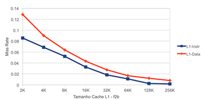
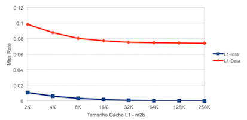
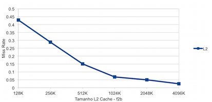
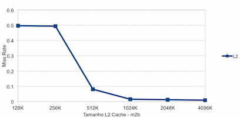
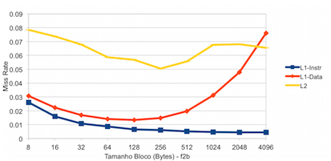
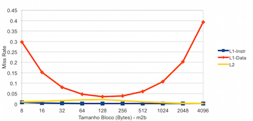
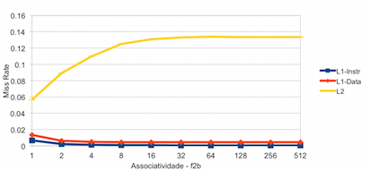
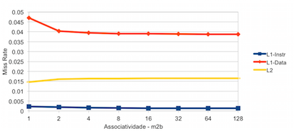

# André Nogueira Brandão - RA 116130
# Exercício 2

Utilizamos o software *Dinero* para simular configurações de cache diferentes. Escolhemos então o programa **GCC** e utilizamos os seus traces de execução para os nossos testes.

Os traces utilizados foram:

- 176.gcc.f2b
- 176.gcc.m2b

Foi decidido que seria testado cada parâmetro separadamente, deixando os outros em valores fixos.

## Tamanho da cache L1

Utilizou-se os seguintes parâmetros com valores fixos:

- Tamanho do Bloco: 32B
- Tamanho da Cache L2: 1024KB
- Associatividade: 1

E variamos os valores da Cache L1 de 2KB a 256KB, obtendo os seguintes gráficos para F2B e M2B.

 

### F2B

Consideramos que não temos uma melhora significativa do miss rate de 64K para 128K, escolhemos o valor da Cache L1 como 64K. Também levamos em conta que com o aumento de tamanho da cache, há um aumento no tempo de acesso.

### M2B

A partir do gráfico foi escolhido o tamanho de 8K para a Cache L1.

## Tamanho da cache L2

Fixamos então os valores das caches L1 e variamos em seguida o tamanho da cache L2.

 

### F2B

- Tamanho do Bloco: 32B
- Tamanho da Cache L1: 64KB
- Associatividade: 1

Notamos que o miss rate diminui consideravelmente até atingirmos o tamanho da cache L2 de 1024K, o qual é o valor que escolhemos.

### M2B

- Tamanho do Bloco: 32B
- Tamanho da Cache L1: 8KB
- Associatividade: 1

Nesse caso notamos que após o tamanho de 1024K, há baixa variação do miss rate. Assim, mantemos o valor da cache L2 em 1024K.

## Tamanho do Bloco

Agora já encontramos os valores para as caches L1 e L2 nos dois tipos de traces (F2B e M2B). Assim, variamos em seguida o tamanho dos blocos.

 

### F2B

- Tamanho da Cache L1: 64KB
- Tamanho da Cache L2: 1024KB
- Associatividade: 1

Para tamanho de bloco acima de 128B, observamos que inicia-se um aumento do *miss rate* da cache L1-Data, logo escolhemos esse valor.

### M2B

- Tamanho da Cache L1: 8KB
- Tamanho da Cache L2: 1024KB
- Associatividade: 1

Escolhe-se o valor de bloco de 128B para o tamanho dos blocos, pois nota-se que após esse valor temos um aumento do *miss rate* de L1-Data.

## Associatividade

O último parâmetro que iremos testar é a associatividade.

 

### F2B

- Tamanho da Cache L1: 64KB
- Tamanho da Cache L2: 1024KB
- Tamanho do Bloco: 128B

Notamos uma leve diminuição do *miss rate* para o cache L1, porém há um aumento desse valor no cache L2. Mesmo assim, decidimos por uma associatividade de valor 2, pelo fato de ser preferível ter uma Cache L1 mais eficiente.

### M2B

- Tamanho da Cache L1: 8KB
- Tamanho da Cache L2: 1024KB
- Tamanho do Bloco: 128B

O *miss rate* se torna praticamente constante após uma associatividade de valor 2, assim escolhemos esse valor.

## Conclusão

As configurações finais para os dois tipos de traces foram as seguintes:

### F2B

|| Cache L1 | Cache L2 | Tamanho Bloco | Associatividade |
|---|---|---|---|---|
|F2B| 64KB | 1024KB|128B|2|
|M2B|8KB|1024KB|128B|2|

É notável a diferença do tamanho da Cache L1 entre os tipos de traces F2B e M2B. Isso provavelmente acontece pois o tipo F2B executa 2 bilhões de instruções, porém o M2B executa 2 bilhões de instruções depois de pular 50 bilhões. 

Assim, o M2B já teria tido uma melhor eficiência para utilizar os caches e assim diminuir o *miss rate*. Isso é facilmente visto nos gráficos na cache L1-Instr, que já se inicia com um *miss rate* menor.

