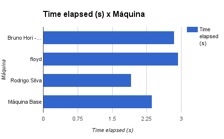

# André Nogueira Brandão - RA 116130
# Projeto 1 - Parte 3

No Projeto 1, tivemos que analisar programas diferentes e rodá-los em máquinas diferentes. Assim, podemos utilizar os dados recolhidos com o intuito de comparar o desempenho desse computadores.

As máquinas utilizadas para a comparação de desempenho do Grupo D foram as seguintes:

| Máquina              	| Configuração                                 		|
|----------------------	|---------------------------------------------		|
| Bruno Hori - Mamonas 	| Intel(R) Core(TM)2 Quad CPU,Q8400,@ 2.66GHz,  4GB RAM 		|
| floyd                	| Intel(R) Core(TM)2 Quad CPU    Q8400  @ 2.66GHz, Memory 4GB 		|
| Rodrigo Silva       	| Intel(R) Core(TM) i5-2450M @ 2.5GHZ; Memory 6GB 	|
| Rafael Faria       	| Intel(R) Core(TM) i7-4750HQ CPU @ 2.00GHz; Memory 8 GB 1600 MHz DDR3; Mac OS X El Capitan (version 10.11.4)	|
| João Paulo			| Intel(R) Core(TM) i7-4510U CPU @ 2.00GHz; Memory 16 GB; Ubuntu 14.04.4 |

## Benchmark 4: Gnuplot

Só conseguimos rodar o programa Gnuplot em máquinas com o sistema Linux, devido à utilização do Perf.

As máquinas do IC também não permitiam a mostra dos dados de mem-stores, por isso, obtivemos o seguintes dados:

| Máquina 	| Time elapsed (s) 	| cpu-clock (msec) 	| mem-stores 	| bus-cycles		|
|-----------|------------------	|------------------	|------------	|--------------		|
| Bruno Hori - Mamonas | 2.846095154 | 2629.389573 |  não foi possível medir | 870,644,555 |
| floyd | 2.939470455 | 2599.674514 |  não foi possível medir | 860,820,627|
| Rodrigo Silva | 1.913255332 | 1854.789746 |  1,967,250,506 | 183,645,061 |

Na parte 2 também executamos o código em uma máquina base, obtendo os dados abaixo.

| Máquina Base | Time elapsed (s) 	| cpu-clock (msec) 	| mem-stores 	| bus-cycles		|
|------------- |------------------	|------------------	|------------	|--------------		|
| Intel(R) Core(TM) i3-3110M CPU @ 2.40GHz 3072 KB Cache, 4GB RAM |  2.366946723 | 2365.136127 |  1,975,542,493 | 235,183,921 |

Com esses dados, percebemos que as duas primeiras máquinas, ou seja, as do IC, possuem configurações iguais, o que é demonstrado nas medidas com seus valores próximos um do outro.

Comparando o tempo de execução, notamos que o computador *Rodrigo Silva* é cerca de 33% mais rápido do que as duas máquinas anteriores e 19% mais rápido que a máquina base. Esse aumento de velocidade também é refletido nas medições de cpu-clock.
Já se utilizarmos a medições de *bus-cycles*, notamos que a máquina mais eficiente utiliza 20% do número de bus-cycles em comparação com as do IC e 77% do número de bus-cycles da máquina base.

Desse modo, podemos inferir que o aumento de performance durante a execução do Gnuplot se deu pelo fato de os processadores i3 e i5 terem um cpu-clock mais rápido, ou seja, executam mais instruções por segundo.
Porém, a maior diferença é notada na nos bus-cycles, o que indica que a leitura e escrita entre a CPU e a memória externa é bem mais eficiente. Isso provavelmente se deu ao fato de os processadores i3 e i5 possuirem uma GPU interna que aumenta a performance da criação dos gráficos do Gnuplot.

## Benchmark 5: Ordenação

A máquina base utilizada foi a máquina a seguir:

*Intel® Core™ i5-4590 CPU @ 3.30GHz × 4; Memory 8 GiB; 64-bit graph: Intel® Haswell Desktop*

| Máquina | Média do pior caso, para o algoritmo mais lento 	| Média do pior caso, para o algoritmo mais rápido 	| Média do caso médio, para o algoritmo mais lento 	| Média do caso médio, para o algoritmo mais rápido	| Média do melhor caso, para o algoritmo mais lento | Média do melhor caso, para o algoritmo mais rápido |
|-----------|------------------	|------------------	|------------	|--------------		| --- | --- |
| Bruno Hori - Mamonas | Bubble Sort: 21.028388s | Quick Sort: 0.004529s |  Bubble Sort: 12.250569s | Quick Sort: 0.004466s | Selection Sort: 9.427739s | Insertion Sort: 0.000538s |
| Rodrigo Silva | Bubblesort: 12.072436s | Quicksort: 0.003145s |  Bubble Sort: 7.674245s | Quicksort: 0.003098s | Selection Sort: 7.147115s | Insertion Sort: 0.000397s |
| Máquina Base | Bubble Sort: 0.428712s | Quick Sort: 0.000573s |  Bubble Sort: 0.249295s | Quick Sort: 0.000560s | Selection Sort: 0.191221s | Insertion Sort: 0.000076s |

A máquina *Bruno Mori* possui configurações inferiores às outras duas máquinas, o que é representando nas amostragens de tempo de execução de cada algoritmo.

Notamos que a máquina *Rodrigo Silva* tem uma performance bem inferior à máquina base, mesmo os dois processadores sendo Intel Core i5. Porém, a máquina base possui 2GB de RAM a mais e ainda possui um clock cerca de 30% mais rápido. Esses provavelmente são os motivos para ter havido um desempenho maior na máquina base.

## Benchmark 7: TCC

Máquina base utilizada:

*Intel® Core™ i7-4702MQ CPU @ 2.20GHz × 8 (64 bits) Memory 8 GiB*

| Máquina 	| Média (10 execuções) 	| Desvio padrão 	|
|-----------|------------------	|------------------	|
| Bruno Hori - Mamonas | 91.7262 | 24.5390 |
| floyd | 129.1190 | 4.7920 |
| Rodrigo Silva | 39.0883 | 1.7143 |
| Máquina Base  | 13.5266 | 0.2310 |

Comparando as duas primeiras máquinas utilizadas, já que possuem a mesma configuração, elas deveriam ter tempos de execução próximos, porém tivemos uma certa diferença. Isso pode ter ocorrido por um dos computadores estar executando mais programas do que o outro, limitando o uso da memória. Apesar de tudo, podemos ainda aceitar esses dados como válidos pelo valor de desvio padrão da primeira máquina.

A máquina base foi a que obteve o maior desempenho por ter um processador Core i7, em comparação com o i5 da terceira máquina e os Core 2Quad das duas primeiras. Isso provavelmente se deve ao fato de a máquina base ter o dobro do número de *Cores* e de *threads*, apesar de ter um *clock* mais lento, além de ter 2GB a mais de RAM.

Porém, dentre as 3 máquinas iniciais, a com maior desempenho foi a *Rodrigo Silva*.

## Benchmark 8: FFTW

Máquina base utilizada com processador *Intel Core i7-450HQ*

| Máquina 	| DFT1D (parâmetro 70.000.000) - Média (5 execuções) [s] 	| Desvio Padrão [s] 	| DFT1D_IO (parâmetro 3.000.000) - Média (5 execuções) [s] | Desvio Padrão [s] |
|-----------|------------------	|------------------	| --- | --- |
| Bruno Hori - Mamonas | 38.3616 | 1.451 | 53.7389 | 3.069 |
| Rafael Faria | 16.2484 | 1.1366 | 16.2284 | 0.2438 |
| João Paulo | 5.9326 | 0.2201 | 29.949 | 0.9738 |
| Máquina Base  | 14.700 |  | 16.010 | |

Nota-se que as máquinas *Rafael Faria* e a máquina base obtiveram dados muito próximos por terem processadores iguais. Já a máquina *Bruno Hori* obteve o pior desempenho de todos por usar um processador Core(TM)2 Quad, o qual possui menos threads, menos *cores* e a máquina ainda tem menos RAM disponível.

O problema nesse benchmark é avaliar o motivo de o computador *João Paulo* ser mais eficiente na execução do tipo DFT1D e menos eficiente no DFT1D_IO ao compararmos com a máquina *Rafael Faria*.

As duas possuem um processador Intel Core i7, porém há algumas diferenças:

|| Processador | Threads | Cores | Memória |
|---|---|---|---|---|
|Rafael Faria | i7-4750HQ | 8 | 4 | 8 GB DDR3 |
| João Paulo| i7-4510U  | 4 | 2 | 16 GB |

Podemos inferir que a máquina *João Paulo*, por ter mais memória, consegue efetuar as instruções de DFT1D mais eficientemente.
Já no caso do DFT1D_IO, o computador precisa efetuar as instruções, alocar memória e ainda imprimir os resultados em um arquivo txt. Assim, a máquina *Rafael Faria*, por possuir mais threads e *cores*, consegue administrar melhor os recursos da máquina, obtendo um melhor resultado.

Sendo assim, a máquina *João Paulo* foi 63% mais rápida com DFT1D, sendo a *Rafael Faria* 45% mais rápida com DFT1D_IO. Assim, não podemos afirmar que uma máquina é mais eficiente do que a outra, sendo que cada uma é mais eficiente para uma função específica.

## Conclusão

Obtivemos problemas com a execução de alguns programas em algumas máquinas, porém, pode-se tentar calcular uma certa pontuação e comparar a performance dos computadores apresentados.
Para isso, fizemos as médias de valores para cada computador em cada benchmark e dividimos pelo valor da máquina base em cada um deles. Criando assim uma pontuação em que a máquina base sempre tem valor 1.0 e as máquinas com valores menores terão uma posição melhor no ranking.
No caso do Benchmark 8 fizemos uma média da pontuação para cada função e depois tiramos a média.

Apesar de não conseguirmos comparar diretamente a performance dessas máquinas, podemos inferir comparando a performance relacionando os dados.
Por exemplo: Sabemos que as máquinas *Rafael* e *João* foram mais eficientes que a *Bruno* no Benchmark 8. Sabemos que a máquina *floyd* teve desempenho menor que a *Bruno*, ficando assim atrás dela. Já a máquina *Rodrigo* foi mais eficiente que a *Bruno* na maioria dos Benchmarks, ficando a frente.
Já para termos um vencedor entre as máquinas *Rafael* e *João*, a primeira teve uma pontuação de 1.06 e a última de 1.14, sendo a do *Rafael* mais eficiente.

A seguir temos a tabela com as máquinas em ordem de melhor para pior performance:

| Máquina              	| Configuração                                 		| Posição |
|----------------------	|---------------------------------------------		| ---|
| Rafael Faria       	| Intel(R) Core(TM) i7-4750HQ CPU @ 2.00GHz; Memory 8 GB 1600 MHz DDR3; Mac OS X El Capitan (version 10.11.4)	| 1 |
| João Paulo			| Intel(R) Core(TM) i7-4510U CPU @ 2.00GHz; Memory 16 GB; Ubuntu 14.04.4 | 2 |
| Rodrigo Silva       	| Intel(R) Core(TM) i5-2450M @ 2.5GHZ; Memory 6GB 	| 3 |
| Bruno Hori - Mamonas 	| Intel(R) Core(TM)2 Quad CPU,Q8400,@ 2.66GHz,  4GB RAM 		| 4 |
| floyd                	| Intel(R) Core(TM)2 Quad CPU    Q8400  @ 2.66GHz, Memory 4GB 		| 5 |

